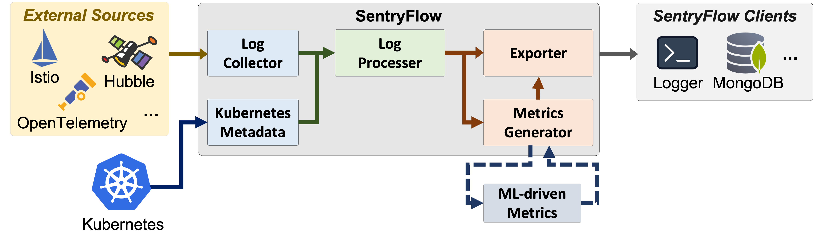

# SentryFlow

SentryFlow is a cloud-native system for API observability, specializing in log collection, and data
exportation.

## Architecture Overview

### Features

- API access observability

[//]: # (- Production of API Metrics)

[//]: # (- AI-driven API Classification &#40;Inference&#41;)

## Documentation

- [Getting Started](docs/getting_started.md)
- [Contribution Guide](docs/CONTRIBUTING.md)
